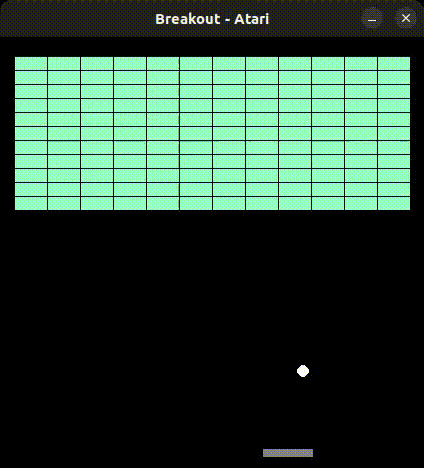

# AI for Game Playing: Atari Breakout AI (Deep Q-Network)



This is an implementation of the classic Atari game Breakout, where an AI plays the game using Deep Q-Network (DQN) learning. The game is created using the Pygame library, and the DQN algorithm is implemented using PyTorch. The AI learns to play Breakout by interacting with the game environment and optimizing its actions based on rewards obtained during gameplay.

## Requirements

Install requirements using the following command:

```bash
pip install -r requirements.txt
```

## Run the code

```bash
cd src/
python net_dqn_test.py 
```

## Train the net

```bash
cd src/
python net_dqn_train.py 
```

## AI Training

The AI uses the DQN algorithm to learn how to play Breakout. During training, it explores different actions in the game and observes the rewards obtained. The AI's goal is to maximize its rewards by adjusting its actions based on the Q-values learned from the DQN.

## Deep Q-Network (DQN) Learning

The training process of the Atari Breakout AI involves using Deep Q-Network (DQN) learning, which is a form of reinforcement learning. DQN combines Q-learning, a value-based RL algorithm, with deep neural networks to approximate the Q-values of different state-action pairs.

### Q-Value Function

In DQN, the AI aims to learn the Q-value function, denoted as $Q(s, a)$, which represents the expected cumulative reward for taking action $a$ from state $s$ and then following the optimal policy thereafter. The Q-value function can be defined recursively as follows:

$$
Q(s, a) = R(s, a) + \gamma \cdot \max[Q(s', a')]
$$

where:
- $R(s, a)$ is the immediate reward obtained by taking action $a$ in state $s$.
- $γ$ is the discount factor, representing the importance of future rewards compared to immediate rewards.
- $s'$ is the next state after taking action $a$ in state $s$.
- $a'$ is the action taken in the next state $s'$.
